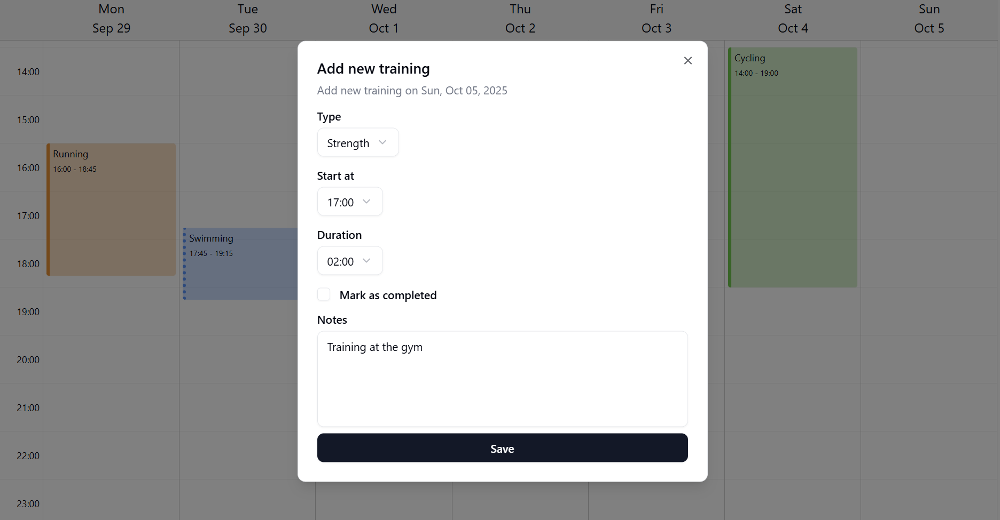

# Triathlog
A simple trainings planner for triathletes.



## Documentation
- [Requirements](./docs/triathlog.md) </br>
- [Documentation](./docs/documentation.md) </br>
- [Images](./docs/images/)
- [Journal](./docs/journal.md)

## Developing

In your `.env` file set the `DATABASE_URL` variable.
You will find a working example configuration in [.env.example](.env.example)

Once you've created the configuration file and installed dependencies with `npm install` (or `pnpm install` or `yarn`), start a development server:

```sh
npm run dev

# or start the server and open the app in a new browser tab
npm run dev -- --open
```

## Building

To create a production version of your app:

```sh
npm run build
```

You can preview the production build with `npm run preview`.

> To deploy your app, you may need to install an [adapter](https://svelte.dev/docs/kit/adapters) for your target environment.

## Docker
In addition to the options shown above this project also ships a docker setup.
To build and run the docker image locally use

```bash
docker build -t triathlog .

docker run \ 
-p 3000:3000 \
-v $(pwd)/db:/db \
triathlog
```

To run the lastest released version of Triathlog use:

```bash
docker run \ 
-p 3000:3000 \
-v $(pwd)/db:/db \
ghrc.io/andreasaff/triathlog:latest
```

Your Triathlog instance will be served at http://localhost:3000