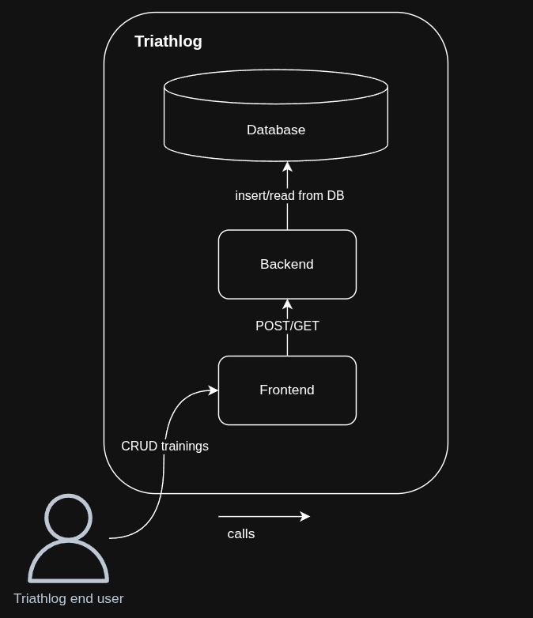
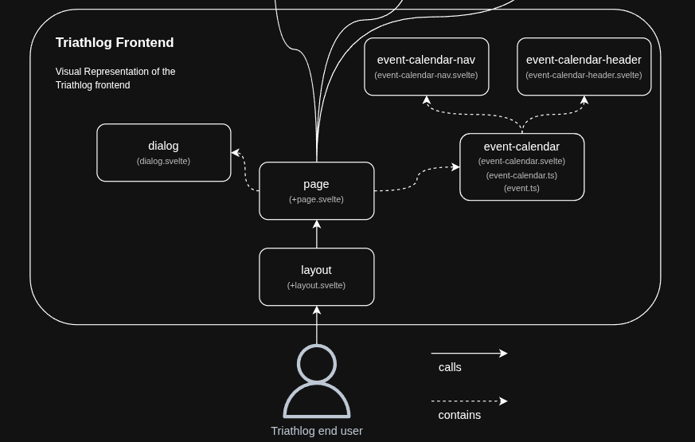
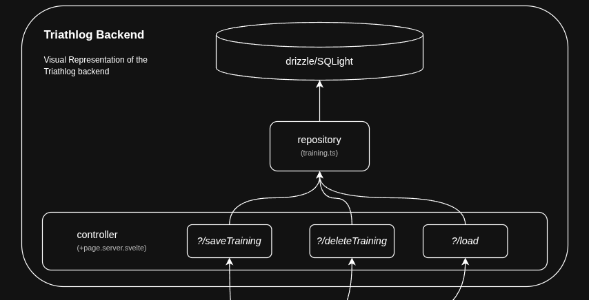
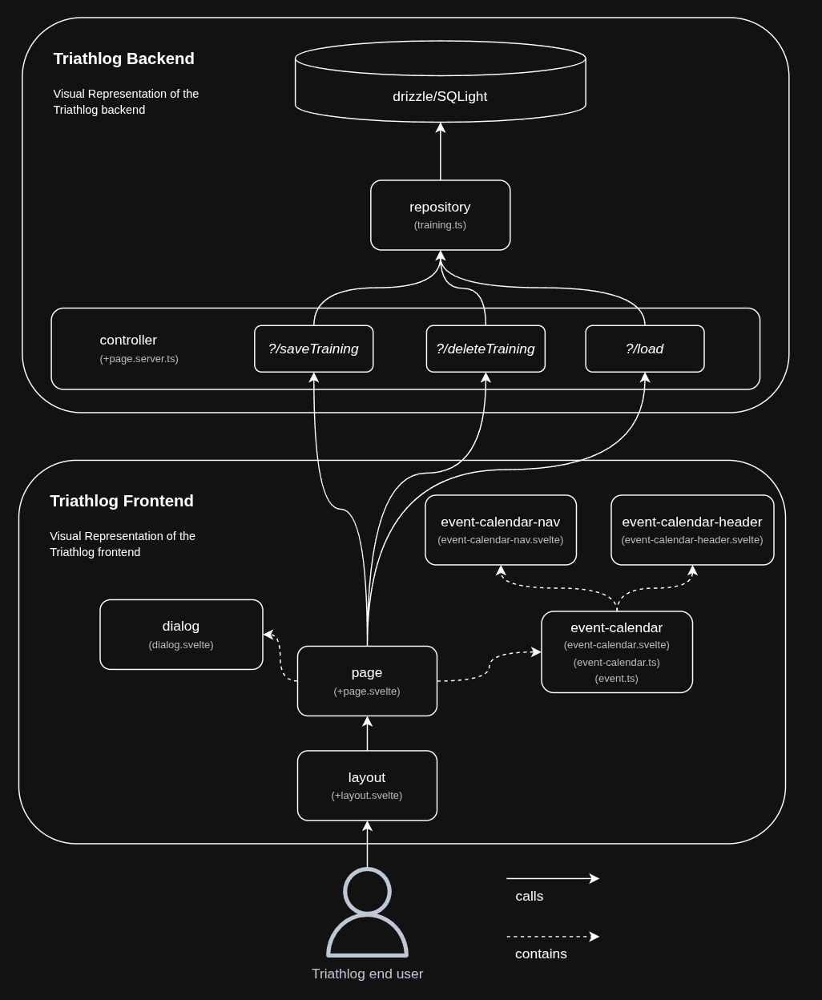
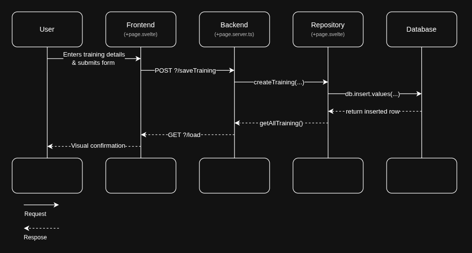

# Triathlog - Documentation

## 1. Introduction & Goals
## 1.1 Context
This project was conducted as part of the [WEBLAB](https://github.com/web-programming-lab/web-programming-lab-projekt) module at HSLU, acting as a greenfield project for learning and deepening knowledge in the realms of web development.

Students were give the option to implement a tech radar or bring their own project ideas to life.
Out of personal need an interest, I opted for the latter, developing a traning planner specifically for triathletes.

## 1.2 Scope
All planned features in this project were documented as user stories, which were then prioritized according to the [MoSCoW](https://en.wikipedia.org/wiki/MoSCoW_method) method.

> Note: User story 8 was added during the development process, as I found it to be a quite important aspect in personal usage of Triathlog. Currently configuration options are very basic and can only be done at build time. Configuration options via GUI were treated out of scope but could be added in future versions.

Nr|Title|Priority|Status
--|-----|--------|------
1|Add training block|_Must_|✅
2|Weekly overview|_Must_|✅
3|Delete previously added training blocks|_Must_|✅
4|Mark as done|_Should_|✅
5|Update existing training blocks|_Could_|✅
6|Recurring Training Blocks|_Could_|❌
7|Stats|_Could_|❌
8|Configurability|_Could_|🔄

A detailed description of the user stories can be found [here](./triathlog.md#requirements)

## 2. Constraints
As part of the assignment a few constraints were made:
- Frontend & backend must both be implemented in a technology from the JavaScript ecosystem
- Project must be developed as individual work
- Around 60h should be spent on the project
- Architectural documentation must be included (strongly suggesting [arc42](https://arc42.org/overview) as a template)

## 3. Context
The following graphic shows the usage and embedding of Triathlog in a real-world scenario.

**Triathlog End User**

In context of Triathlog a triathlete preparing for his next race could be considered an end user.
He wants to plan his training efforts, check which trainings lie ahead of him and mark trainings as completed.

**Triathlog**

Composed of a frontend, backend and database, Triathlog keeps track of training sessions planned by a triathlete. Planned trainings are stored persistently in a file-based database and retrieved for display on the frontend.
Apart from the enduser, Triathlog does not interact with any other outside systems.

## 4. Solution Strategy

### 4.1 Full-Stack Framework [SvelteKit](https://svelte.dev/)
At its core, Triathlog uses SvelteKit as a full-stack framework in the frontend as well as in the backend. This choice was mainly based on the fact that I already wanted to get to know the Svelte ecosystem before, and this seemed like a good opportunity. Besides that, with its steadily growing community, Svelte offers a lot of guides and help on getting started, even with little prior knowledge of web development. With SvelteKit being a full-stack framework, it fits very well in the given constraint of using JavaScript on the frontend as well as the backend.

### 4.2 UI Library - [shadcn-svelte](https://shadcn-svelte.com/)
In order to provide a seamless and consistent design across the application, I opted for the usage of a component library, which came in the form of shadcn-svelte, a Svelte port of the original shadcn React library. Shadcn-svelte offers a wide variability of prebuilt UI components, which can be further customized by using custom CSS classes. The built-in [Form](https://shadcn-svelte.com/docs/components/form) component furthermore provides a wrapper around [sveltekit-superforms](https://github.com/ciscoheat/sveltekit-superforms) allowing for sophisticated client- and server-side form validation. 

### 4.3 CSS Framework - [TailwindCSS](https://tailwindcss.com/)
Shadcn-svelte already uses TailwindCSS under the hood to style its components. Therefore, using it for further styling of the shadcn-svelte and custom-built components comes as an obvious choice. Nevertheless, this does not restrict the usage of custom CSS classes.

### 4.4 ORM - [Drizzle](https://orm.drizzle.team/)
To ease interaction with the database and thus enhance developer experience, Drizzle was chosen as the Object Relation Mapping (ORM) tool. Drizzle comes prepacked with SvelteKit and features seamless integration with SQLite featuring the better-sqlite3 driver. While Triathlog is based on a rather trivial DB schema, the database migration feature of Drizzle makes it easy to migrate to a possible new schema, keeping Triathlog open for future expansions. 

### 4.5 DB - [SQLite](https://sqlite.org/)
With the idea in mind that Triathlog should be deployed and usable locally without the need for any internet/server connection, it's obvious that data has to be stored on the device. Given the use case and my prior knowledge, I wanted to use an SQL database for storing the data. These two constraints basically left SQLite as the option to be chosen.

## 5. Building Block View
## 5.1 Frontend
> Note: All components imported from thrid-part libraries were omitted in order to increase readability.

Currently, Triathlog consists of a single page containing the form for saving/editing/deleting trainings as well as embedding the calendar component. When clicking on a timeslot or a existing training in the calendar component, an event object, containing `id?`, `date`, `startTime`, `durationMin`, `description?`, `isCompleted?` is passed to the page via a callback prop. This allows the page to recognize the currently selected timeslot or event in the calendar and prefill the form for saving/editing trainings. 

## 5.2 Backend
The backend is realized with a single controller exposing the `?/saveTraining` and `?/deleteTraining` endpoints. For data fetching Svelte's `?/load` endpoint is used. The endpoints use a repository in order to read and write data from the database. This allows for abstraction and hiding of the detailed persistence layer implementation in the endpoints. Should it ever come into play, this greatly reduces the complexity of migrating to another database technology.

## 5.3 Complete System
Combining the frontend and the backend, the complete system looks as shown in the diagram below.

## 6. Runtime View
The runtime view below shows the sequence of events happening upon creating/updating/deleting (CRUD) trainings from Triathlog.

## 7. Deployment View
Focusing on the sole development of the appliation no production ready deployment method (e.g Docker container) has been created yet.

## 8. Architectural Decisions

### 8.1 Custom event-calendar component
Searching for a prebuilt calendar component integrating neatly with the planned Triathlog functionality, not many options were found. The only real option,  [EventCalendar](https://github.com/vkurko/calendar) looked way too complex and feature-rich for the intended use case. On the other hand developing a custom component would require a considerable amount of time.

**Decision**

In the end the decision was made to develop a tailor-made event-calendar component, fitting the exact needs of Triathlog and therefore reducing overall complexity by only providing what's needed.

### 8.2 Using JS native Date API
Due to the nature of the project and its heavy reliance on date and time objects,
multiple third-party packages like [date-and-time](https://www.npmjs.com/package/date-and-time) and [date-time](https://www.npmjs.com/package/date-time) were considered, enhancing JavaScript's Date API and thus making it easier to work with. 

**Decision**

In the end it was decided to stick with JavaScript's core Date API, keeping the event components less dependent at the cost of a slight compromise in developer experience. 

## 9. Quality Requirements
The Triathlog application should comply with the following set of quality requirements:

- Functionality should be validated using automated unit & integration tests.
- The solution should be portable (locally runnable on every desktop)
- With a 4G connection, the initial page load should be completed within 1sec

The quality requirements can also be found [here](./triathlog.md#quality-features)

## 10. Risks & Technical Debt
During development the following accumulated risks and technical debts where identified.

|Title|Description|Type|time estimate|
|-----|-----------|----|-------------|
|Testing|Currently there is no automated testing done in Triathlog. Adding some components and e2e tests would greatly help cut down the time needed for manual testing and ensure componets work as expected after changes.|Issue|8h
|Configurability|Currently available trainig disciplines are hardcoded and can't be changed. Allowing for configurability disciplines would help in better fitting Triathlog to individual athletes needs.|Feature|4h

## 11. Reflection
With little to no prior background in web development, getting to know all these concepts of developing web applications on top of getting to know an entire framework came as a steep learning curve.

Luckily, having a very extensive tutorial on [svelte.dev](https://svelte.dev/tutorial/svelte/welcome-to-svelte) helped me get going faster than initially anticipated. Whenever I had any problems, I could go back to the documentation and be assured there would be information found to solve my problem. In the rare occasion where this wasn't the case, there were some great blogs, Stackoverflow and some short explanations from ChatGPT at hand, eventually resolving the matter.

A very challenging part for me was getting the UI to look how I imagined it in my head into reality, as I am really not that great at UI-Design. However, with the help of some already prebuilt UI components, I would say that I am pleased with how it turned out in the end. 

Another little annoyance was the proper definition of the zod schema for form validation. I had quite some time lost there, as validating timestamps threw me a validation error without useful information on which part of the string was invalid.

All in all, developing Triathlog was a very enjoyable project for me to work on. I got to know many new concepts and technologies, which I hopefully can put to use again in future. I envision continuing working on Triathlog, making it a viable planning tool towards my goal of completing an [Ironman 70.3](https://en.wikipedia.org/wiki/Ironman_70.3) in 2026.

## 12. Glossary
|Abbrevation|Description|
|-----------|-----------|
|SQL| Structured Query Language|
|ORM| Object Relation Mapping|